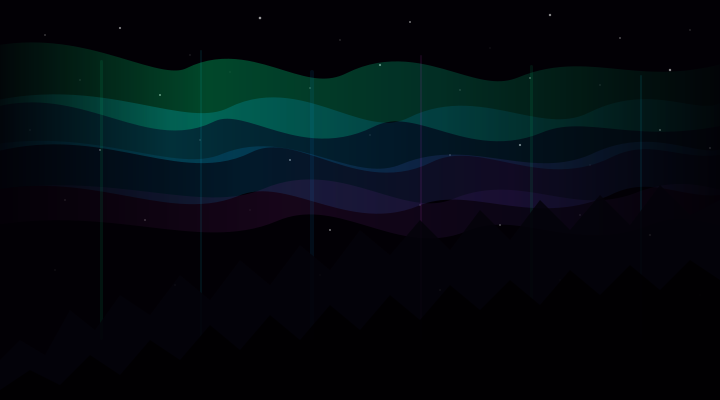

# Aurora BG

[](https://www.npmjs.com/package/aurora-bg)
[](https://github.com/alehar9320/aurora-bg/actions/workflows/ci.yml)
[](https://bundlephobia.com/package/aurora-bg)
[](https://github.com/alehar9320/aurora-bg/blob/main/LICENSE)
[](https://alehar9320.github.io/aurora-bg/)
[](https://alehar9320.github.io/aurora-bg/)

> **Native Web aurora borealis background animation.**  
> Framework-agnostic, zero dependencies. 60fps canvas-powered aurora for React, Vue, Angular, Svelte, or vanilla HTML.

---

## Preview

<p align="center">
  <a href="https://alehar9320.github.io/aurora-bg/">
    
  </a>
  <br>
  <em>⬆️ Click for live interactive demo — the aurora animates in real time</em>
</p>

---

## Features

- **Zero dependencies** — nothing to install besides this package
- **Canvas-based** — 60fps animation, hardware accelerated
- **Web Component** — use as a `<aurora-bg>` tag, works anywhere
- **Programmatic API** — `new AuroraEngine(canvas, options)` for full control
- **Responsive** — auto-resizes with `ResizeObserver`
- **Accessible** — respects `prefers-reduced-motion`
- **4-layer magnetic curtain simulation** — realistic aurora wave physics
- **Twinkling star field** — with parallax depth
- **Ion micro-particle drift** — adds organic liveliness
- **Mountain silhouettes** — optional animated foreground
- **Scroll parallax** — depth effect on scroll

---

## Quick Start

### Option A: CDN (no build tool needed)

```html
<script src="https://cdn.jsdelivr.net/npm/aurora-bg/dist/aurora.umd.js"></script>
<script>auroraBg.defineAuroraBg()</script>
<aurora-bg colors="#00ff88,#00aaff" density="0.7"></aurora-bg>
```

### Option B: npm

```bash
npm install aurora-bg
```

```ts
import { defineAuroraBg } from 'aurora-bg'
defineAuroraBg()
```

```html
<aurora-bg colors="#00ff88,#00aaff" density="0.7"></aurora-bg>
```

### Option C: Imperative (any framework)

```ts
import { AuroraEngine } from 'aurora-bg'

const canvas = document.getElementById('my-canvas') as HTMLCanvasElement
const engine = new AuroraEngine(canvas, {
  colors: ['#00ff88', '#00aaff'],
  density: 0.7,
  speed: 1.0,
})
engine.start()
```

---

## 🤖 Copy-Paste Prompts for Your AI Assistant

Paste any prompt below into your AI coding assistant (Claude, ChatGPT, Copilot, Cursor, etc.) to add aurora-bg instantly.

### Vanilla HTML / No Build Tool

> Add an aurora borealis animated background to my HTML page using the aurora-bg
> CDN. Include the script from https://cdn.jsdelivr.net/npm/aurora-bg/dist/aurora.umd.js,
> call auroraBg.defineAuroraBg(), and add a \<aurora-bg\> element with
> colors="#00ff88,#00aaff" density="0.6" mountains. Make it full-screen fixed background.

### React (Any CLI / Vite / CRA)

> Add an aurora borealis background to my React app. Install the npm package
> `aurora-bg`, import { defineAuroraBg } from 'aurora-bg', call it once at app root,
> and render \<aurora-bg\> as a fixed full-screen background behind my app content.
> Use colors="#00ff88,#00aaff" and the mountains attribute.

### Vue 3

> Add an aurora borealis animated background to my Vue 3 app. Install `aurora-bg`,
> import { defineAuroraBg } from 'aurora-bg', call it in App.vue's onMounted hook,
> and add a \<aurora-bg\> element as a fixed full-screen background with
> colors="#00ff88,#00aaff" density="0.7".

### Svelte

> Add an aurora borealis background to my Svelte app. Install `aurora-bg`,
> import { defineAuroraBg } from 'aurora-bg' in +layout.svelte's onMount,
> call it, and add \<aurora-bg\> as a fixed full-screen background behind content.

### Angular

> Add an aurora borealis animated background to my Angular app. Install `aurora-bg`,
> import { defineAuroraBg } from 'aurora-bg', call it in AppComponent's ngOnInit,
> and add \<aurora-bg\> as a full-screen fixed background element.

### Next.js (App Router)

> Add an aurora borealis background to my Next.js app. This uses client-side
> canvas + Web Components. Create a 'use client' wrapper component that imports
> { defineAuroraBg } from 'aurora-bg', calls it, and renders \<aurora-bg\>.
> Place it as a fixed full-screen background.

### Custom Canvas (Imperative API)

> Add an aurora borealis animation to a specific \<canvas\> element on my page.
> Install the npm package `aurora-bg`, import { AuroraEngine } from 'aurora-bg',
> create a new engine instance with the canvas and options like
> { colors: ['#00ff88', '#00aaff'], density: 0.7, mountains: true },
> then call engine.start(). Clean up with engine.destroy() on unmount.

### Configuration Tuning

> I have aurora-bg on my page. I want to tweak it: set colors to
> ['#ff0066', '#ff8800', '#ffcc00'] for a sunset aurora, density to 0.8,
> speed to 0.5, and opacity to 0.9. Show me how to update these options
> at runtime using the setOptions() method on AuroraEngine.

> For more prompts and deeper coverage, see [`AI.md`](./AI.md) — the definitive AI reference with 40+ prompts organized by framework and use case.

---

## Quick Reference

```typescript
// === AURORA-BG QUICK REFERENCE ===
// Install: npm install aurora-bg
// CDN:     https://cdn.jsdelivr.net/npm/aurora-bg/dist/aurora.umd.js
// UMD global: auroraBg

// Web Component (declarative — works in any framework)
import { defineAuroraBg } from 'aurora-bg'
defineAuroraBg()
// <aurora-bg colors="#00ff88,#00aaff" density="0.6" mountains></aurora-bg>

// Imperative (programmatic)
import { AuroraEngine } from 'aurora-bg'
const engine = new AuroraEngine(canvas, {
  colors: ['#00ff88', '#00aaff'],
  density: 0.6,
  speed: 1.0,
  opacity: 0.8,
  intensity: 1.0,
  scrollFactor: 0.5,
  mountains: true,
})
engine.start()                            // begin animation
engine.setOptions({ colors: ['#ff0066'] }) // runtime update
engine.setScroll(window.scrollY)           // parallax input
engine.resize()                            // auto-resize
engine.stop()                              // pause animation
engine.destroy()                           // full cleanup
```

---

## Framework Integration

### React

```tsx
// aurora-bg.tsx
import { defineAuroraBg } from 'aurora-bg'

// Call once at app entry point
defineAuroraBg()

export function AuroraBackground({ children }: { children: React.ReactNode }) {
  return (
    <div style={{ position: 'relative', minHeight: '100vh' }}>
      <aurora-bg
        colors="#00ff88,#00aaff"
        density="0.6"
        mountains
        style={{
          position: 'fixed',
          inset: 0,
          zIndex: 0,
          pointerEvents: 'none',
          display: 'block',
        }}
      />
      <div style={{ position: 'relative', zIndex: 1 }}>
        {children}
      </div>
    </div>
  )
}
```

### Vue 3

```vue
<!-- App.vue -->
<script setup>
import { onMounted } from 'vue'
import { defineAuroraBg } from 'aurora-bg'

onMounted(() => {
  defineAuroraBg()
})
</script>

<template>
  <div class="app">
    <aurora-bg
      colors="#00ff88,#00aaff"
      density="0.6"
      mountains
      style="position: fixed; inset: 0; z-index: 0; pointer-events: none; display: block;"
    />
    <div class="content" style="position: relative; z-index: 1;">
      <router-view />
    </div>
  </div>
</template>
```

### Svelte

```svelte
<!-- +layout.svelte -->
<script>
  import { onMount } from 'svelte'
  import { defineAuroraBg } from 'aurora-bg'

  onMount(() => {
    defineAuroraBg()
  })
</script>

<aurora-bg
  colors="#00ff88,#00aaff"
  density="0.6"
  mountains
  style="position: fixed; inset: 0; z-index: 0; pointer-events: none; display: block;"
/>

<div style="position: relative; z-index: 1;">
  <slot />
</div>
```

### Angular

```typescript
// app.component.ts
import { Component, OnInit } from '@angular/core'
import { defineAuroraBg } from 'aurora-bg'

@Component({
  selector: 'app-root',
  template: `
    <aurora-bg
      colors="#00ff88,#00aaff"
      density="0.6"
      mountains
      style="position: fixed; inset: 0; z-index: 0; pointer-events: none; display: block;"
    ></aurora-bg>
    <div style="position: relative; z-index: 1;">
      <router-outlet></router-outlet>
    </div>
  `,
})
export class AppComponent implements OnInit {
  ngOnInit() {
    defineAuroraBg()
  }
}
```

---

## API Reference

### Options (`AuroraOptions`)

| Option | Type | Default | Description |
|--------|------|---------|-------------|
| `colors` | `string[]` | `['#00ff88', '#00aaff', '#ff44ff']` | Hex color palette |
| `density` | `number` | `0.5` | Particle density (0–1) |
| `speed` | `number` | `1.0` | Animation speed multiplier |
| `opacity` | `number` | `0.8` | Overall opacity (0–1) |
| `intensity` | `number` | `1.0` | Aurora brightness (0–2) |
| `scrollFactor` | `number` | `0.5` | Scroll parallax influence |
| `mountains` | `boolean` | `false` | Render animated silhouettes |

### `AuroraEngine` Methods

| Method | Returns | Description |
|--------|---------|-------------|
| `start()` | `void` | Begin the animation loop |
| `stop()` | `void` | Pause the animation loop |
| `destroy()` | `void` | Clean up all resources (canvas, listeners, RAF) |
| `setOptions(opts)` | `void` | Update options at runtime |
| `setScroll(y)` | `void` | Update scroll position for parallax |
| `resize(w?, h?)` | `void` | Resize canvas (auto-detects parent if called without args) |

### `<aurora-bg>` Attributes

Same as options, but as HTML attributes. Boolean attributes (like `mountains`) are true when present.

```html
<aurora-bg
  colors="#00ff88,#00aaff"
  density="0.7"
  speed="0.8"
  opacity="0.9"
  intensity="1.2"
  scroll-factor="0.3"
  mountains
></aurora-bg>
```

### JSON Schema

```json
{
  "AuroraOptions": {
    "colors":       { "type": "string[]", "default": "['#00ff88','#00aaff','#ff44ff']", "description": "Hex color palette" },
    "density":      { "type": "number",   "default": 0.5, "range": [0, 1], "description": "Particle density" },
    "speed":        { "type": "number",   "default": 1.0, "range": [0, 2], "description": "Animation speed multiplier" },
    "opacity":      { "type": "number",   "default": 0.8, "range": [0, 1], "description": "Overall opacity" },
    "intensity":    { "type": "number",   "default": 1.0, "range": [0, 2], "description": "Aurora brightness" },
    "scrollFactor": { "type": "number",   "default": 0.5, "range": [0, 1], "description": "Scroll parallax influence" },
    "mountains":    { "type": "boolean",  "default": false,                "description": "Render animated silhouettes" }
  }
}
```

---

## Accessibility

The animation **automatically pauses** when the user's system has `prefers-reduced-motion: reduce` enabled.

## Browser Support

Chrome, Firefox, Safari, Edge — all modern browsers that support Canvas API and Custom Elements v1.

---

## 📖 AI Reference

For AI coding assistants and power users: [`AI.md`](./AI.md) is a dedicated reference file containing:

- **40+ copy-paste prompts** organized by framework and use case
- Full API signatures for all exports
- Complete `AuroraOptions` interface with defaults
- Lifecycle management patterns (React, Vue, Svelte, Angular, Next.js)
- Troubleshooting prompts
- Agent instructions for effective prompting

---

## Contributing

See [CONTRIBUTING.md](./CONTRIBUTING.md).

## License

MIT © Alexander Härenstam
